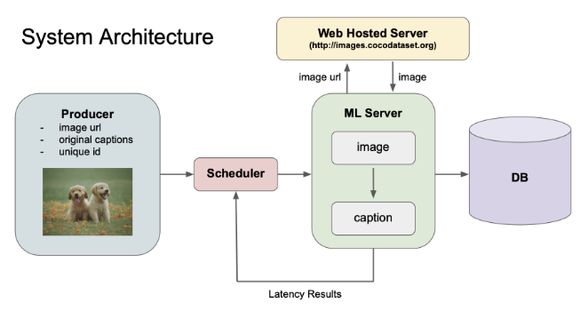

# Cloud System for Web-Based Accessibility using Synthetic Recaptioning

## Authors

- **Siddharth Shah**  
  Department of Computer Science, Vanderbilt University  
  Email: siddharth.p.shah@vanderbilt.edu  

- **Aditya Shrey**  
  Department of Computer Science, Vanderbilt University  
  Email: aditya.shrey@vanderbilt.edu  

- **Haoli Yin**  
  Department of Computer Science, Vanderbilt University  
  Email: haoli.yin@vanderbilt.edu  

---

## Project Overview

This project simulates a **cloud-based system for enhancing web accessibility** through synthetic recaptioning of images. The system replicates real-world workflows involving task distribution and machine learning (ML) inference, utilizing scheduling algorithms to optimize performance. It integrates a **Producer-Scheduler-ML Server** pipeline, with each module encapsulated in Docker containers and orchestrated using Kubernetes. The architecture supports testing and comparison of scheduling algorithms under realistic workloads.

Key features of the system include:
- **Task Scheduling Algorithms**: Implements Random, Round Robin, Historical Latency, Least Ongoing Tasks, and Time Series Forecasting strategies.  
- **Kafka Integration**: Utilizes Apache Kafka for task messaging and Zookeeper for coordination.  
- **Scalable System Design**: Deploys all components as Docker containers managed by Kubernetes for scalability and reliability.  
- **Synthetic Recaptioning**: Simulates Vision-Language Model functionality for resource-efficient testing.  

---

## System Design and Architecture

### Overview
The system consists of the following components:
- **Producer**: Generates tasks (image URL, original caption, and unique ID).  
- **Scheduler**: Implements various load-balancing algorithms for efficient task assignment.  
- **ML Server**: Simulates VLM processing by resizing images and introducing delays.  
- **Database**: Consolidates all processed task results into a SQLite database.

### Architecture Diagram


### Load Balancing Strategies
The scheduler supports multiple load-balancing algorithms:
- **Random Scheduling**: Assigns tasks randomly to servers.  
- **Round Robin Scheduling**: Distributes tasks cyclically across servers.  
- **Lowest Historical Average**: Assigns tasks to servers with the lowest average latency.  
- **Least Ongoing Tasks**: Balances tasks dynamically based on active workloads.  
- **Time Series Forecasting**: Predicts server latency using polynomial regression.

---

## Implementation

### Dataset
The system uses the **MS COCO dataset** for image URLs and captions. Preprocessed metadata is used to avoid runtime delays, but images are retrieved dynamically by the ML server.  
Cite: *Lin, et al. Microsoft COCO: Common Objects in Context, 2014.*

### Components
1. **Producer**:
   - Streams tasks to Kafka in JSON format.  
   - Example JSON:  
     ```json
     {
       "iter_id": 1,
       "image_url": "http://example.com/image.jpg",
       "caption": "A cat sitting on a table."
     }
     ```

2. **Scheduler**:
   - Implements the load-balancing algorithms.  
   - Assigns tasks to ML servers and forwards results to the database.

3. **ML Server**:
   - Simulates VLM inference using image resizing and randomized delays.

4. **Database**:
   - SQLite database consolidates task results, including:
     - Unique Task ID  
     - Image URL  
     - Original Caption  
     - Simulated VLM Output  
     - Total Latency  

---

## Deployment Instructions

### Prerequisites
1. **Docker**: Install Docker and enable `docker buildx`.  
2. **Kubernetes**: Ensure `kubectl` and a Kubernetes cluster are configured.  
3. **Kafka**: Set up Apache Kafka with Zookeeper.  

### Deployment Commands

#### **Check Cluster Health and Node Resources**
```bash
kubectl get nodes
kubectl get pods -A
kubectl describe pod <pod-name>
```

#### **Check Pods in a Specific Namespace**
```bash
kubectl get pods -n <namespace>
kubectl describe pod <pod-name> -n <namespace>
```

#### **Deploy Zookeeper and Kafka**
```bash
cd ./communication

kubectl apply -f zookeeper.yaml
kubectl apply -f kafka.yaml
```

#### **Deploy Producer**
```bash
cd ./producer

docker buildx build -f dockerfile -t producer .

docker tag producer:latest 192.168.5.182:5000/producer
docker push 192.168.5.182:5000/producer

docker rmi producer:latest
docker images

kubectl apply -f producer.yaml
```

#### **Deploy Scheduler**
```bash
cd ./scheduler
docker buildx build -f dockerfile -t scheduler .

docker tag scheduler:latest 192.168.5.182:5000/scheduler
docker push 192.168.5.182:5000/scheduler

docker rmi scheduler:latest
docker images

kubectl apply -f scheduler.yaml
```

#### **Deploy VLM Server**
```bash
cd ./vlm
docker buildx build -f dockerfile -t vlm .

docker tag vlm:latest 192.168.5.182:5000/vlm
docker push 192.168.5.182:5000/vlm

docker rmi -f vlm:latest
docker images

kubectl apply -f vlm.yaml
```

#### **Deploy CNN Server**
```bash
cd ./cnn
docker buildx build -f dockerfile -t cnn .

docker tag cnn:latest 192.168.5.182:5000/cnn
docker push 192.168.5.182:5000/cnn

docker rmi -f cnn:latest
docker images

kubectl apply -f cnn.yaml
```

#### **Deploy DB Server**
```bash
cd ./db
docker buildx build -f dockerfile -t db .

docker tag db:latest 192.168.5.182:5000/db
docker push 192.168.5.182:5000/db

docker rmi db:latest
docker images

kubectl apply -f db.yaml
```

#### **Terminate Deployed Pods**
```bash
cd ./producer
kubectl delete -f producer.yaml

cd ./scheduler
kubectl delete -f scheduler.yaml

cd ./vlm
kubectl delete -f vlm.yaml

cd ./cnn
kubectl delete -f cnn.yaml

cd ./db
kubectl delete -f db.yaml
```

---

### Additional Kubernetes Commands

#### **Access Pod**
```bash
kubectl exec --stdin --tty <pod-name> -- /bin/bash
# Example
kubectl exec --stdin --tty cnn-54bd46cbf-pzs9b -- /bin/bash
```

#### **Install vim in Pod**
```bash
kubectl exec -it vlm-858fff56bd-4nxmw -- apt-get update
kubectl exec -it vlm-858fff56bd-4nxmw -- apt-get install vim -y
kubectl exec -it vlm-858fff56bd-4nxmw -- vim --version
```

#### **Copy Files from Pod to Local Machine**
```bash
kubectl cp <namespace>/<pod_name>:/app/<filename.ext> ./<filename.ext>
```

---

## References
- MS COCO Dataset: [Microsoft COCO](http://cocodataset.org/)  
- Kafka: [Apache Kafka](https://kafka.apache.org/)  
- Kubernetes: [Kubernetes Documentation](https://kubernetes.io/docs/home/)  

---

For further assistance, contact Siddharth Shah (siddharth.p.shah@vanderbilt.edu) or refer to the detailed system documentation.